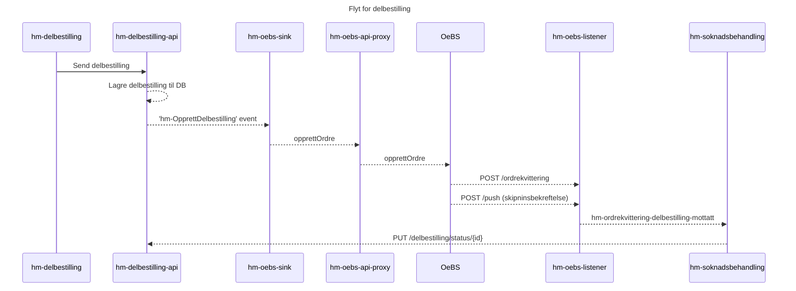

# hm-delbestilling

Frontend-applikasjon for bestilling av deler fra teknikere

## Kjøre lokalt med mockede data

1. `npm install` (for å installere nav-dekoratoren-moduler så må man logge npm.pkg.github.com med PAT første gang. Se instrukser i [nav-dekoratoren-moduler README](https://github.com/navikt/nav-dekoratoren-moduler#ved-lokal-kj%C3%B8ring))

2. Start applikasjonen med `npm run dev`. Da brukes [Mock Service Worker](https://mswjs.io/) for å mocke API-endepunkter, slik at man ikke trenger å starte noen backend.
   
3. Gå til `localhost:3000`

## Testguide

| artnr  | serienr | resultat ved oppslag                          | resultat ved innsending                                |
| ------ | ------- | --------------------------------------------- | ------------------------------------------------------ |
| 222222 | 333333  | Returnerer hjelpemiddel (Panthera Light)      | Gyldig innsending                                      |
| 167624 | 123123  | Returnerer hjelpemiddel (Comet Alpine)        | Gyldig innsending                                      |
| 000000 | 000000  | Tilbyr ikke deler til produkt                 | N/A                                                    |
| 333333 | 000000  | Inget utlån på bruker                         | N/A                                                    |
| 444444 | 000000  | Feilmelding om for mange requests (ratelimit) | N/A                                                    |
| 222222 | 000000  | Returnerer hjelpemiddel                       | Bruker ikke funnet                                     |
| 222222 | 111111  | Returnerer hjelpemiddel                       | Innsender prøver å bestille til seg selv               |
| 222222 | 444444  | Returnerer hjelpemiddel                       | Ulik geografisk tilknytning                            |
| 222222 | 555555  | Returnerer hjelpemiddel                       | Kan ikke bestille                                      |
| 222222 | 666666  | Returnerer hjelpemiddel                       | Kan ikke bestille pga for mange bestillinger siste 24t |

