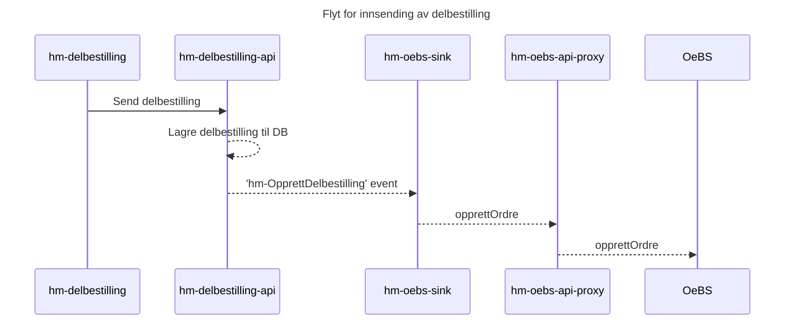
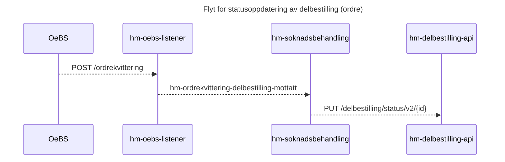
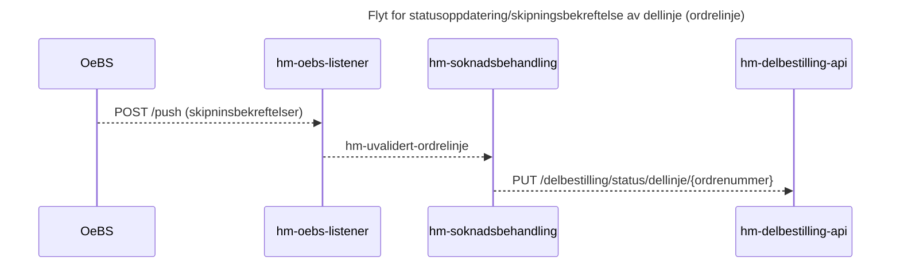

# hm-delbestilling

Frontend-applikasjon for bestilling av deler fra teknikere

Koden er delt i to separate moduler:

- `server` – Go-backend
- `client` – React-frontend

## Kom i gang

### Forutsetninger

- Node ≥ 20
- Go (for serveren)

### Installasjon

1. Installer avhengigheter fra prosjektroten:
```bash
pnpm install
```

2. Start applikasjonen lokalt med mockede data:
```bash
pnpm run dev
```

Applikasjonen bruker [Mock Service Worker](https://mswjs.io/) for å mocke API-endepunkter, så du trenger ikke å starte backend.

3. Gå til `localhost:3000`

## Test med Playwright lokalt
Kjør `pnpm run playwright` eller `pnpm run playwright:ui`.

## Bygge for produksjon

```bash
pnpm build
```

Dette bygger client (TypeScript + Vite) og server (Go) sekvensielt.

Du kan også bygge dem uavhengig:
```bash
pnpm run build:client  # TypeScript + Vite build
pnpm run build:server  # Go build
```

## Testguide

| artnr  | serienr | resultat ved oppslag                          | resultat ved innsending                                |
| ------ | ------- | --------------------------------------------- | ------------------------------------------------------ |
| 222222 | 333333  | Returnerer hjelpemiddel (Panthera Light)      | Gyldig innsending                                      |
| 167624 | 123123  | Returnerer hjelpemiddel (Comet Alpine)        | Gyldig innsending                                      |
| 000000 | 000000  | Tilbyr ikke deler til produkt                 | N/A                                                    |
| 333333 | 000000  | Inget utlån på bruker                         | N/A                                                    |
| 666666 | 000000  | Oppslag på ikke-hovedhjelpemiddel             | N/A                                                    |
| 444444 | 000000  | Feilmelding om for mange requests (ratelimit) | N/A                                                    |
| 222222 | 000000  | Returnerer hjelpemiddel                       | Bruker ikke funnet                                     |
| 222222 | 111111  | Returnerer hjelpemiddel                       | Innsender prøver å bestille til seg selv               |
| 222222 | 444444  | Returnerer hjelpemiddel                       | Ulik geografisk tilknytning                            |
| 222222 | 555555  | Returnerer hjelpemiddel                       | Kan ikke bestille                                      |
| 222222 | 666666  | Returnerer hjelpemiddel                       | Kan ikke bestille pga for mange bestillinger siste 24t |


```mermaid
---
title: Flyt for innsending av delbestilling
---

sequenceDiagram;
    hm-delbestilling->>hm-delbestilling-api: Send delbestilling;
    hm-delbestilling-api-->>hm-delbestilling-api: Lagre delbestilling til DB;
    hm-delbestilling-api-->>hm-oebs-sink: 'hm-OpprettDelbestilling' event;
    hm-oebs-sink-->>hm-oebs-api-proxy: opprettOrdre;
    hm-oebs-api-proxy-->>OeBS: opprettOrdre;
```

---


```mermaid
---
title: Flyt for statusoppdatering av delbestilling (ordre)
---

sequenceDiagram;
    OeBS-->>hm-oebs-listener: POST /ordrekvittering;
    hm-oebs-listener-->>hm-soknadsbehandling: hm-ordrekvittering-delbestilling-mottatt
    hm-soknadsbehandling-->>hm-delbestilling-api: PUT /delbestilling/status/v2/{id}
```

---


```mermaid
---
title: Flyt for statusoppdatering/skipningsbekreftelse av dellinje (ordrelinje)
---

sequenceDiagram;
    OeBS-->>hm-oebs-listener: POST /push (skipninsbekreftelser)
    hm-oebs-listener-->>hm-soknadsbehandling: hm-uvalidert-ordrelinje
    hm-soknadsbehandling-->>hm-delbestilling-api: PUT /delbestilling/status/dellinje/{ordrenummer}
```

For skipningsbekreftelse så sendes allerede eventet `hm-uvalidert-ordrelinje` til rapid for bruk i hm-kommune-api, derfor kan hm-soknadsbehandling lytte etter dette. hm-soknadsbehandling plukker da opp mange irrelevante ordrelinjer, men hm-delbestilling-api er i stand til å gjenkjenne hva som er relevant via `ordrenr` (fra OeBS). hm-soknadsbehandling filtrerer på `hjelpemiddeltype == "Del"`, men sender ellers alt videre til hm-delbestilling-api.

---

## WCAG

[WCAG-rapport ligger her](https://a11y-statement.nav.no/reports/e235e6ea-91d9-4e41-a5b4-dc1a1968e8fb)
